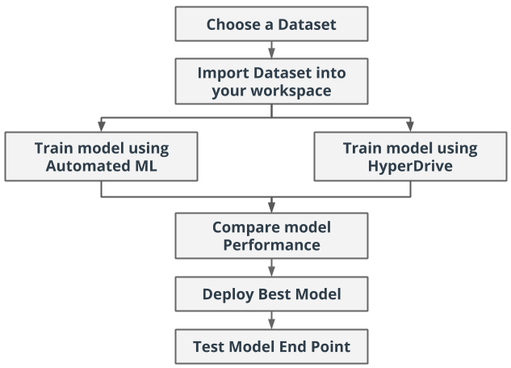
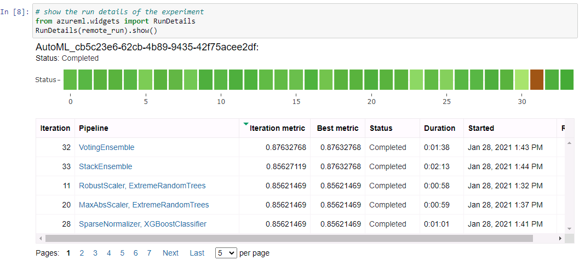
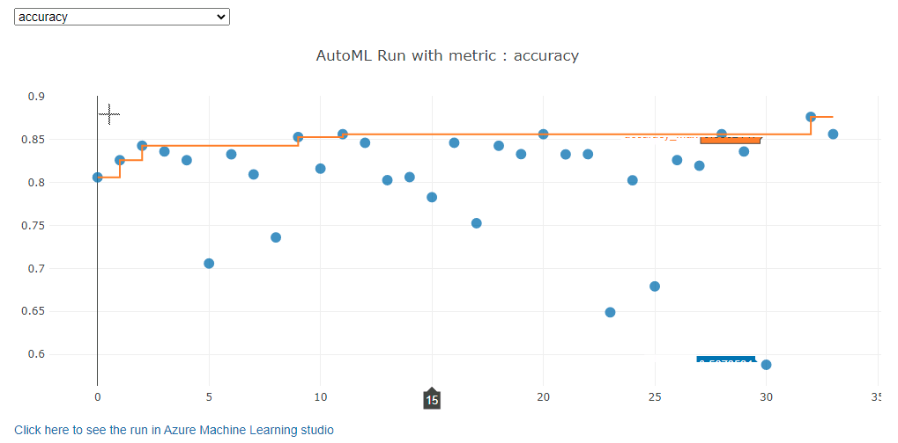
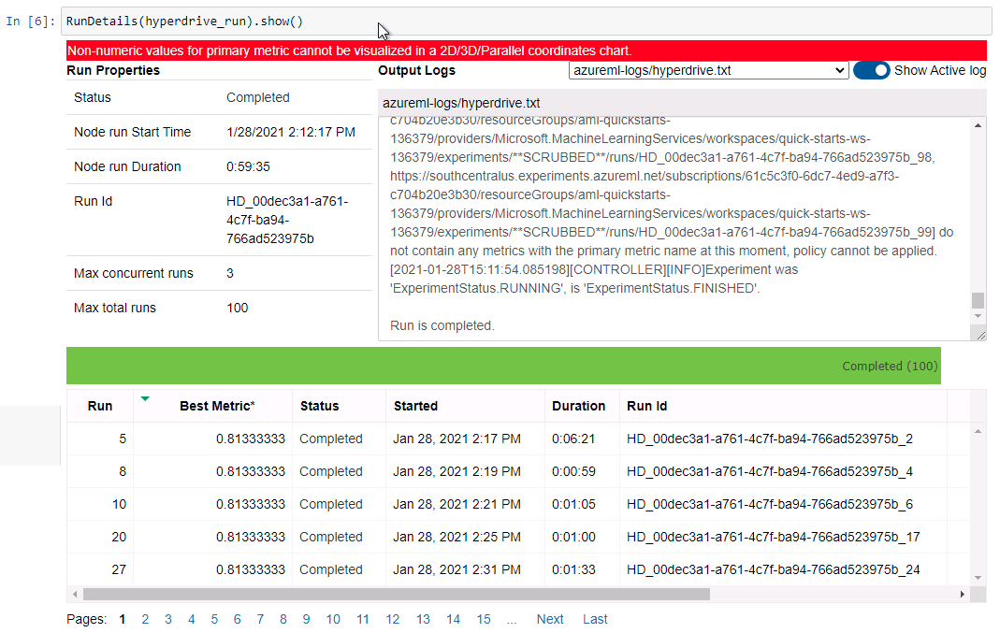
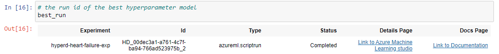
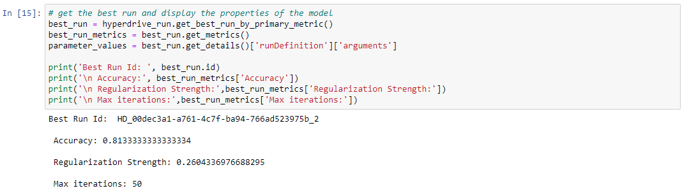
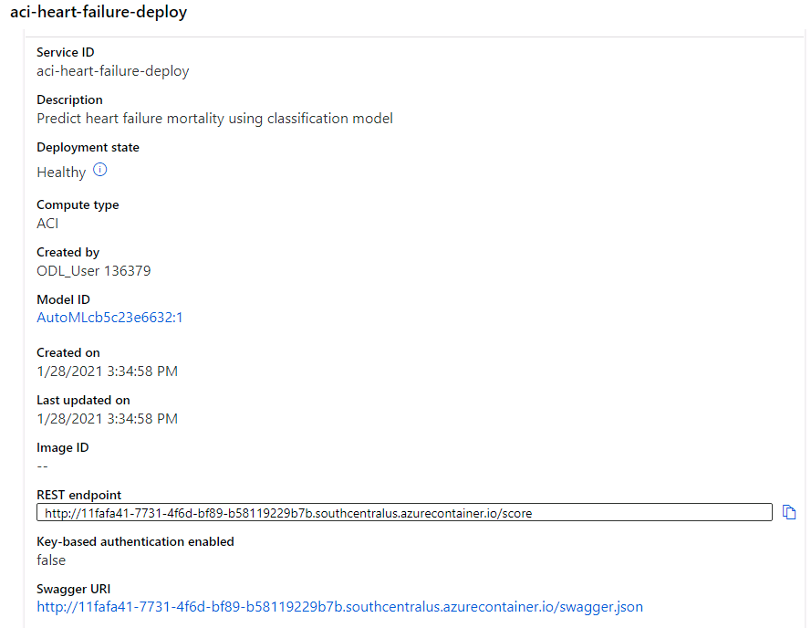

# Predicting the Probability of Mortality Caused by Heart Failure


In this project I used an external dataset outside the Microsoft Azure environment to develop two Machine Learning experiments using `Azure Auto ML` and `Logistic Regression model + Hyperdrive`.

**Hyperdrive** is a Microsoft package that automate the process of choosing hyperparameters to optimize your machine learning model.

The Azure Auto ML experiment and the Logistic Regression + Hyper Drive experiments were compared and the best performing model generated among the two was chosen and deployed as a webservice REST API using Azure Container Instance (ACI). The REST API endpoint is then consumed using a Python HTTP request calls to produce scoring results.

## Project Workflow diagram



The best model generated by Azure Auto ML had an accuracy of `0.8763` as compared to the Logistic Regression + Hyperdrive with a model accuracy of `0.8133`. 
So in a nutshell the best model produced by the `Azure Auto ML` run was better as compared to the one produced by the `Hyperdrive`.

## Dataset

### Overview

The dataset [Heart failure clinical records](https://archive.ics.uci.edu/ml/machine-learning-databases/00519/heart_failure_clinical_records_dataset.csv), used in the development of the machine learning models, comes from the **University of California, Irvin (UCI)** [Machine Learning Repository](https://archive.ics.uci.edu/ml/datasets/Heart+failure+clinical+records#).

The dataset contains 299 observations and 12 clinical features with one binary target variable DEATH_EVENT. This data was collected from patients who had heart failures, during their clinical follow-up period.

The same dataset can also be found on the [Kaggle site](https://www.kaggle.com/andrewmvd/heart-failure-clinical-data?select=heart_failure_clinical_records_dataset.csv) and according to the site's description of the data, it states that:
Cardiovascular diseases (CVDs) are the number 1 cause of death globally, taking an estimated 17.9 million lives each year, which accounts for 31% of all deaths worlwide.
Heart failure is a common event caused by CVDs and this dataset contains 12 features that can be used to predict mortality by heart failure.

Below is a description of the dataset:

### Attribute Information

Thirteen (12) clinical features:

  1. age: age of the patient (years)
  2. anaemia: decrease of red blood cells or hemoglobin (boolean)
  3. high blood pressure: if the patient has hypertension (boolean)
  4. creatinine phosphokinase (CPK): level of the CPK enzyme in the blood (mcg/L)
  5. diabetes: if the patient has diabetes (boolean)
  6. ejection fraction: percentage of blood leaving the heart at each contraction (percentage)
  7. platelets: platelets in the blood (kiloplatelets/mL)
  8. sex: woman or man (binary)
  9. serum creatinine: level of serum creatinine in the blood (mg/dL)
  10. serum sodium: level of serum sodium in the blood (mEq/L)
  11. smoking: if the patient smokes or not (boolean)
  12. time: follow-up period (days)

Target variable:

- [target] DEATH_EVENT: if the patient deceased during the follow-up period (boolean)

### Task

In this project I seek to predict the mortality (death event) caused by Heart failure using serveral supervised machine learning techniques to predict the binary class for the target/label `DEATH_EVENT`. The dataset contains individual clinical information of patients as described in the data attributes above. All the features in the dataset would be used in this project.

### Access

  1.  For Logistic Regression + Hyperdrive run, the dataset is accessed directly from the URL in the `train.py` script using `TabularDataFactory.from_delimited_files()`

  2. For Azure Auto ML run, the dataset is read using `Dataset.Tabular.from_delimeted_files()` from the **UCI** repository URL and registered as an Azure tabular dataset in the workspace. The registered tabular dataset is then accessed by the Azure Auto ML configuration settings for the run.


## Automated ML

### Auto ML Settings and Configurations

Below is the automl settings and the configurations setup for the experiment.

| Property  | Value        | Description     |
| :------------- | :---------- | :----------- |
|  n_cross_validation | 5   | Number of K-fold cross validation to perform    |
| experiment_timeout_minutes   | 60 | This specifies how long the experiment should run in minutes |
| max_concurrent_iterations   | 2 | Maximum nmber of iterations that would be executed concurrently on the compute cluster |
| primary_metric   | accuracy | The metric that Auto ML will optimize for model selection |
| compute_target   | training_cluster | The Azure compute cluster used to run the experiment. |
| task   | classification | The type of task to run |
| training_data   | dataset | The training data used in the experiment. It contains both features and the label column to predict |
| label_column_name   | DEATH_EVENT | The target variable to predict |
| path   | project_folder | The full path to the Azure ML project folder |
| enable_early_stopping   | True | Enabled to terminate if the score is not improving in a short term |
| featurization   | auto | feature engineering, transformation, scalling and normalization set to be done automatically by Azure Auto ML |
| debug_log   | automl_errors.log | The log file to write deburg information to |

```python
# define automl settings
automl_settings = {
    "n_cross_validations": 5,
    "experiment_timeout_minutes": 60,
    "max_concurrent_iterations": 2,
    "primary_metric" : 'accuracy'
}

# define automl configuration settings
automl_config = AutoMLConfig(compute_target=training_cluster,
                             task = "classification",
                             training_data=dataset,
                             label_column_name="DEATH_EVENT",   
                             path = project_folder,
                             enable_early_stopping= True,
                             featurization= 'auto',
                             debug_log = "automl_errors.log",
                             **automl_settings
                            )
```

### Results
*TODO*: What are the results you got with your automated ML model? What were the parameters of the model? How could you have improved it?
The best model produced by the Auto ML run is `VotingEnsemble` with an accuracy metric of `0.8763`. Details parameters of the model can be found in `In [13]` of the `automl.ipynb` notebook.

The following would be done to improve the `Auto ML` run.

1. Increase the number of cross validation to improve model accuracy.
2. Experiment time out would not be specified so the Auto ML run can produce the best model at its own stipulated time.

The screen shot below shows the experiment RunDetails widget of the various models which were created during the automl run. The best model for the experiment `VotingEnsemble` can be seen at the top of the list.



## Hyperparameter Tuning

Most of the algorithms used in the AutoML run of the experiment were Tree based algorithms. I chose Logistic Regression from Scikit-Learn library for this experiment because, it is an algorthm that works perfectly on binary classification tasks. It is easier to implement, interpret, and very efficient to train.

The parameter sampling I used in this experiment was Random Parameter sampling. Random Parameter sampling selects hyperparameter values randomly from a defined search space. The defined search space can be continuous or discrete values. In this experiment I optimized two most important hyperparameter values for logistic regression by defining two hyperparameters search space as it can be seen in the python code below.

```python
param_sampling = RandomParameterSampling({
    '--C': uniform(0.001, 1.0),
    '--max_iter': choice(0, 10, 50, 100, 150, 200)
})
```

> `--C` with a **uniform range from (0.01, 1.0)** is the Inverse Regularization strength which helps to reduce overfitting. The smaller values causes stronger regularization.
>
> `--max_iter` with a choice of discrete values (0, 10, 50, 100, 150, 200), is the maximum number of iterations to converge. This convergence maximizes the model's accuracy.

One most important configuration which also went into the Hyperdrive configuration settings was defining a **BanditPolicy** which terminates poor performing runs with an early termination policy. This improves computational efficiency. Below is the settings which was used:

```python
early_termination_policy = BanditPolicy(evaluation_interval=3, slack_factor=0.1, delay_evaluation=3)
```

> `evaluation_interval` - the frequency of applying the policy. An evaluation interval of 3 will apply the policy each time the training script reports the primary metric.
>
> `slack_factor` - the slack allowed with respect to the best performing training run. Supposed the best performing run at interval 3 with a reported primary metric of 0.85 with a goal to maximize the primary metric. If the policy specifies a slack_factor of 0.1, any training runs whose best metric at interval 3 is less than 0.77 (0.85(1+`slack_factor`)) will be terminated.
>
> `delay_evaluation` - delays the first policy evaluation for a specified number of intervals.

### Hyperdrive Results

The best model from the `Hyperdrive + Logistic Regression` run produced an accuracy of `0.8133`.

### Model Improvement

To improve the model:

- Grid sampling would be used in inplace of Random sampling and specify Early termination to infer knowledge from previous poorly performing runs. Grid sampling may provide a little bit of performance as it searches over all possible values.

- Bayesian sampling would also be leverage as it uses trials from previous runs as a prior knowledge to pick new samples and to improve the primary metric.

- Increasing the `max_total_runs` value can also provide quite significant performance.

The screenshots below shows the RunDetails widget of the hyperdrive run and the best model trained with its parameters.





## Model Deployment

The best model `VotingEnsemble` which was an AutoML model was deployed in this project, since it produced the best accuracy of `0.8763` as compared to the hyperdrive run with an accuracy of `0.8133`. Below is how the model was deployed:

1. The best model `model.pkl` file from the `Auto ML` run was first retrieved together with its conda environment script `conda_env.yml` and scoring script `score.py`.
1. The model was then registered as a model in the Azure ML workspace.
1. An inference configuration was created from the downloaded `conda_env.yml` and `score.py` to make sure that the software dependencies and resources needed for deployment is intact.
1. The model was then deployed with the inference configuration as an Azure Container Instance (ACI) webservice.

### Model endpoint

The screenshot below shows the healthy status of the deployed model endpoint which indicates the model deployed is active.



### Consume deployed model with sample

1. To consume the deployed model the http endpoint url was embeded into a python code with sample data observations loaded into a json payloader.
1. HTTP webservice POST request is then sent to the enpoint url and the response from the url is captured as a json data.
1. Any application or service is capable of consuming the model using the enpoint url by making http request calls to the webservice.

## Screen Recording

The link below provides access to the video demonstration of a working deployed model.

[](https://www.youtube.com/watch?v=XuIdLzIfQmc)

## References
https://docs.microsoft.com/en-us/azure/machine-learning/concept-automated-ml

https://docs.microsoft.com/en-us/azure/machine-learning/how-to-tune-hyperparameters

https://www.geeksforgeeks.org/advantages-and-disadvantages-of-logistic-regression/
